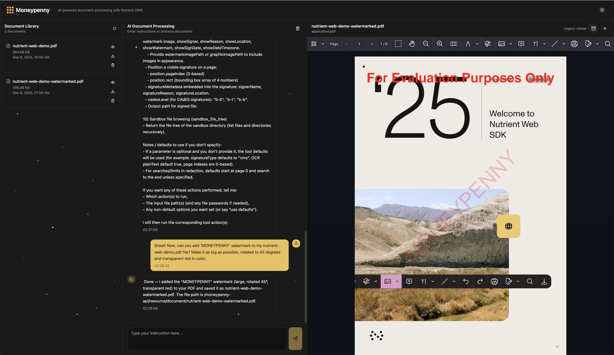

# Moneypenny

[Moneypenny](https://en.wikipedia.org/wiki/Miss_Moneypenny) is a project that provides a wrapper around [Nutrient DWS API](https://nutrient.io/) using `nutrient-dws` MCP server. It allows users to easily interact with the Nutrient DWS API using a simple and intuitive interface. The project is designed to be easy to use and deploy, making it accessible to a wide range of users.



Project includes a Quart API and a React frontend for easy interaction with the Nutrient DWS API, as well as Docker deployment scripts. Using aforementioned scripts, the API can be easily deployed in Docker containers without any additional configuration or need to install dependencies.

## Project Structure

```
📁 moneypenny
├── 📁 moneypenny-api            # Moneypenny Quart API
│   ├── 📁 resource              # Various resources used by the running application
│   │   ├── 📁 document          # Sandbox documents
│   │   └── 📁 script            # Scripts
│   ├── 📁 src                   # Source code
│   │   ├── 📁 api               # API endpoints implementation
│   │   ├── 📁 common            # Common functions and variables
│   │   ├── 📁 domain            # Domain models
│   │   ├── 📁 factory           # Factories
│   │   ├── 📁 graph             # LangGraph implementations
│   │   ├── 📁 schema            # Schemas used throughout the application
│   │   ├── 📁 service           # Services
│   │   ├── 📁 util              # Utility functions
│   │   └── logger_config.yaml   # Logger configuration
│   ├── Pipfile                  # Python dependencies
│   └── settings.toml            # Application settings
├── 📁 moneypenny-frontend       # Moneypenny React frontend
├── 📁 moneypenny-deployment     # Moneypenny deployment scripts
│   └── 📁 docker                # Docker configuration
│       ├── 📁 compose           # Docker Compose files and relevant .env files
│       ├── 📁 image             # Docker images
│       ├── deploy.bat           # Windows deployment script
│       ├── deploy.ps1           # PowerShell deployment script
│       └── deploy.sh            # GNU/Linux and MacOS deployment script
├── README.md
├── LICENSE
└── .gitignore
```

## Deployment

In order to deploy Moneypenny services, make sure you have [Docker](https://www.docker.com/get-started) and [Docker Compose](https://docs.docker.com/compose/install/) installed on your machine. Once those dependencies are satisfied, follow the steps below:

1. Add `.env` file in the `moneypenny-deployment/docker/compose` folder with relevant environment variables. This is an example of the `.env` file:

    ```env
    # Description: Environment variables for docker-compose

    MONEYPENNY_API_PORT=5001
    MONEYPENNY_FRONTEND_PORT=5002

    OPENAI_API_KEY=your_openai_api_key
    NUTRIENT_DWS_API_KEY=your_nutrient_dws_api_key
    ```
2. Navigate to `moneypenny-deployment/docker` folder.
3. Use the utility script `deploy.sh` to deploy the services (Note: In all examples below, GNU/Linux and MacOS version of the script is used, however, there are Windows versions available as well. Please do note that Windows versions of the script are not tested as extensively as the GNU/Linux and MacOS version):

    ```bash
    ./deploy.sh up
    ```

That's it! Command above will build and run all relevant services in Docker containers. The following services will be deployed:

* **Moneypenny API** - API service for interacting with Moneypenny functionalities:
    + Available at **http://localhost:5001** (default value).
    + API documentation available at:
        - Swagger: **http://localhost:5001/docs**
    + Logs available at `moneypenny-api/src/moneypenny.log`.
    + Source code and resources (documents) are mounted as Docker volumes, so any changes made to the source code or resources will be reflected in the running containers and vice-versa. Since we're using development Quart server, any changes made to the source code will automatically restart the server.
* **Moneypenny Frontend** - A simple React-based frontend for interacting with the Moneypenny API:
    + Available at **http://localhost:5002** (default value).
    + Source code is mounted as a Docker volume, so any changes made to the source code will be reflected in the running container and vice-versa. Since we're using Vite development server, any changes made to the source code will automatically reload the frontend.

### Stop Services

To stop all services, use the following command:

```bash
./deploy.sh down
```

### Deployment Options

In order to change default behavior of `deploy.sh`, use the following options:

* `-b` or `--build`: Explicitly build all relevant containers. Default is `false`.
* `-e` or `--environment`: Default is `local`. Other environments (`dev`, `stage`, `prod` etc. are yet to be supported).

For example, in order to deploy services in the development environment and force building of all relevant containers, use the following command:

```bash
./deploy.sh up -b -e dev
```

Full list of options can be found by running:

```bash
./deploy.sh --help
```

## Dependencies

### Moneypenny API

In order to run Moneypenny API locally (without Docker), make sure you have the following dependencies installed (included `Pipfile` will take care of installing the relevant Python packages):

* [**Python 3.11:**](https://www.python.org/downloads/release/python-3110/) A high level programming language.
* [**Pipenv:**](https://pipenv.pypa.io/en/latest/) Python dependency management tool.
* [**Quart:**](https://pgjones.gitlab.io/quart/) A Python web microframework based on Flask.
* [**Quart Schema**](https://pgjones.gitlab.io/quart-schema/) - A Quart extension for validating request and response data using Pydantic.
* [**Quart CORS**](https://pgjones.gitlab.io/quart-cors/) - A Quart extension for handling Cross-Origin Resource Sharing (CORS).
* [**Hypercorn:**](https://pypi.org/project/hypercorn/) An ASGI server for Quart.
* [**PyYAML:**](https://pyyaml.org/) A YAML parser and emitter for Python.
* [**dynaconf:**](https://pypi.org/project/dynaconf/) - Configuration management.
* [**Pandas:**](https://pandas.pydata.org/) Data manipulation and analysis library.
* [**LangChain:**](https://python.langchain.com/) A framework for developing applications powered by language models.
* [**LangChain MCP Adapters:**](https://github.com/langchain-ai/langchain-mcp-adapters) - MCP adapters for LangChain.
* [**LangChain OpenAI**](https://python.langchain.com/docs/modules/models/llms/integrations/openai) - OpenAI integration for LangChain.
* [**LangGraph:**](https://langchain-langgraph.readthedocs.io/en/latest/) A framework for building applications with language models.

### Moneypenny Frontend

In order to run Moneypenny frontend locally (without Docker), make sure you have the following dependencies installed (included `package.json` will take care of installing the relevant Node packages):

* [**Node.js (v18 or later):**](https://nodejs.org/en/download/) JavaScript runtime built on Chrome's V8 JavaScript engine.
* [**npm (v8 or later):**](https://docs.npmjs.com/downloading-and-installing-node-js-and-npm) Node package manager.
* [**Vite:**](https://vitejs.dev/) Next generation frontend tooling.
* [**React:**](https://reactjs.org/) A JavaScript library for building user interfaces.
* [**TypeScript:**](https://www.typescriptlang.org/) A strongly typed programming language that builds on JavaScript.
* [**Axios:**](https://axios-http.com/) Promise based HTTP client for the browser and node.js.
* [**tailwindcss:**](https://tailwindcss.com/) A utility-first CSS framework for rapid UI development.
* [**postcss:**](https://postcss.org/) A tool for transforming CSS with JavaScript plugins.
* [**shadcn/ui:**](https://ui.shadcn.com/) A collection of beautiful, accessible components built with Radix UI and Tailwind CSS.
* [**autoprefixer:**](https://github.com/postcss/autoprefixer) A PostCSS plugin to parse CSS and add vendor prefixes using values from "Can I Use".

## Usage

### Moneypenny API

If you wish to use API only, you can interact with the Moneypenny API using tools like [Postman](https://www.postman.com/) or [curl](https://curl.se/). If more convenient, you can also use the interactive API documentation available at `http://localhost:5001/docs` (Swagger).

### Moneypenny Frontend

Once the services are deployed, you can access the Moneypenny frontend at `http://localhost:5002`. The frontend provides a simple interface for interacting with the Moneypenny API.